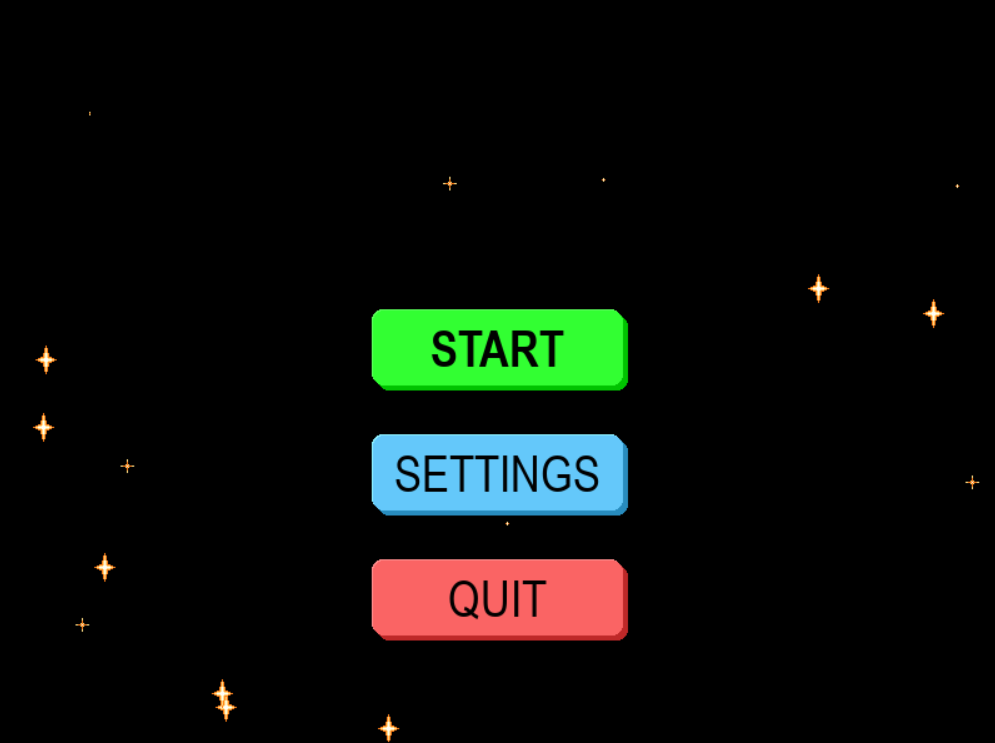
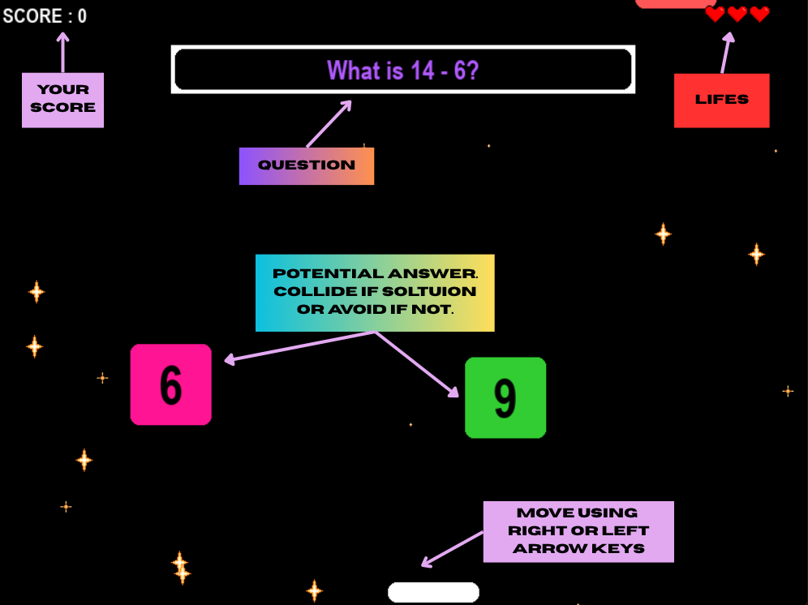
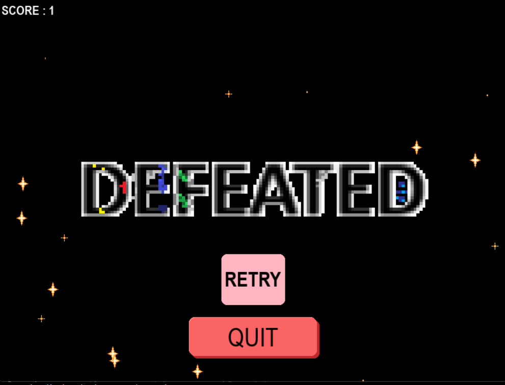

# FRT

## Game Screens

The game has four windows:

- Menu Screen  
- Settings Screen  
- GamePlay Screen  
- Defeat Screen  

*technically there is a fifth screen as well, but it is a BUG that is to be removed after i am done with task 13* ☺️  

---

## MENU SCREEN



Very straight forward.  

- Enter the Game  
- Change Settings  
-  or Quit  

---

## GAME SCREEN



Currently the player is that white rectangular blob with no personality but it will be customizationable in future .. (in near future ☺️)

Your mission:

Move the *Player* Left or Right to either:

- Let falling *Option* collide with *Player* if the option is correct  
- Avoid *Option* if it isn't  

Questions will appear on the Top Centre Label. They will change when *Player* collides with *Option* irrespective of right or wrong.

If the *Player* Collides with Correct *Option* then Score will go up by 1.  
If the *Player* Collides with Wrong *Option* then 1 *Life* will be deducted and when no *Lifes* are left, the Game ends in defeat and *Defeat Screen* is displayed.

---

## DEFEAT SCREEN



---

## Requirements

- pygame-ce 2.5.4  
- python 3.12 or check whether the pygame-ce 2.5.4 is compatible with newer version  

---

## Installation

To install via terminal (if you have created Virtual Environment already):

```bash
pip install pygame-ce==2.5.4
```

---

## Virtual Environment Setup

### ON WINDOWS

```bash
python.exe -m venv venv
venv/Scripts/activate
pip install pygame-ce==2.5.4
```

### ON MAC

```bash
python3 -m venv venv
source venv/bin/activate
pip install pygame-ce==2.5.4
```

---

## Game Description

This project is make a game so irritating and insufferable that no one likes to play it.

As of now:

- One rectangle (player) controlled through left arrow key and right arrow key  
- Questions and options (blocks with options) fall from the top of the screen  

You have to:

- Avoid the wrong options  
- Collide with the right option  

You have three hearts representing three possible mistakes you can do.

---

## Branches

Currently, there are two branches:

- Main  
- AnimationIssue  

---

# MAIN BRANCH

## Structure

audio    
| -> game-bonus-2-294446.mp3  
| -> game-level-complete-143022.mp3  
| -> level-up-89823.mp3  

img  
| -> defeated.png  
| -> red-heart.png  
| -> star.png  
| -> VICTORY.png  

UI  
| -> __init__.py  
| -> block.py  
| -> button.py  
| -> label.py  
| -> raisedButton.py  

audio.py  
data.json  
datahandle.py  
display_Elements.py  
main.py  
new_data.json  
settings.json  

---

## Running the Program

After activating virtual environment, make sure FRT folder is opened in terminal:

```bash
python main.py
```

OR

```bash
python3 main.py
```

---

## UI Folder

Contains the classes:

- Block  
- Button  
- Label  
- RaisedButton  

### Block Class

Creates the block object that falls during game screen.

This class has an attribute *autofit* that fits the given text within limited dimension. This attribute was headache and causing problem for good week of coding this game. Right now it is fixed and working as intended (I think).

#### autofit method

<details>
This attributes take boolean value and its set to true then its set the given text into specificed dimension initilised at the creation of object. And it will store the necessary details of text (such as its rect, fontSize) and will use that for displaying/drawing block. and will recalculate the text details everytime a new text is given via set_text( new_text ) method.
</details>

---

### RaisedButton Class

RaisedButton class is upgraded version of Button class.

- Feels more like a button than Button class  
- Can be disabled  

Honestly, I don't know why I still have Button class. I might delete it in future.

---

## Other Files

### settings.json

Stores the music / sfx On or Off state only.  
In future they will (hopefully) store more states such as sensitivity, volume, keyboard only, mouse only, or both.

### audio.py

According to settings stored in settings.json, audio file plays when called upon by main.py.

### data.json and new_data.json

- data.json contains about 30 arithmetic questions  
- new_data.json contains some general knowledge questions  

Currently only data.json is accessed by datahandle.py.

---

## THE ISSUE

As of right now:

- Animation feels choppy  
- Sound needs to be changed  
- Victory and Defeat visuals need improvement  

---

# AnimationIssue BRANCH

## Purpose

This branch was created for the sole purpose of dealing with animation issue.

After rewriting the whole code multiple times and rechecking everything in MAIN BRANCH and still not fixing the choppy animation issue, I created this branch.

Here I rewrote the whole logic in a single file named testfile.py.  
Surprisingly, it worked.

While working on it, I found the issue with Label class. However, after fixing that issue, animation in main.py still felt choppy while testfile.py was smooth.

---

## Structure

audio  (not used)  
img  
| -> defeated.png (not used)  
| -> red-heart.png  
| -> star.png  
| -> VICTORY.png (not used)  

UI  
| -> __init__.py  
| -> block.py  
| -> button.py  
| -> label.py  
| -> raisedButton.py  

audio.py (not used)  
data.json (not used)  
datahandle.py (not used)  
display_Elements.py (not used)  
main.py (not used)  
new_data.json (not used)  
settings.json (not used)  

data1.json (same data in different format)  
testfile.py (MAIN FILE)  

---

## Running This Branch

```bash
python testfile.py
```

OR

```bash
python3 testfile.py
```

---

## Future-Things

- Add audio to AnimationIssue branch  
- Add Victory/Defeat window  
- Add setting page  
- Remove unnecessary files  
- Add dynamic creation of arithmetic questions  
- Add player image and more features  

---

## Final Note

IF you have read this till now and are infurated by this and Please consider me for internship at your place  

Email: jagrath07@gmail.com
